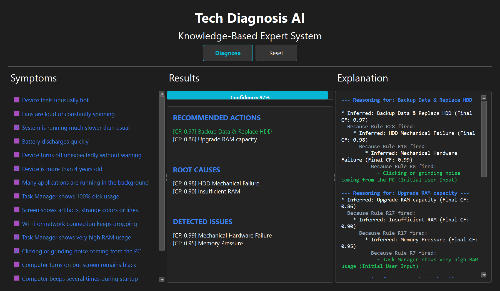

# Tech Diagnosis AI 💻🛡️
> A sophisticated, multi-layer Knowledge-Based Expert System (KBS) built in Python for diagnosing computer hardware and software issues.

This repository implements a fully symbolic AI system. It features a custom **Forward-Chaining Inference Engine** with **Confidence Factor (CF) Propagation**, paired with a beautiful **PySide6 Dark-Themed GUI** and an **Explanation System** (XAI) that renders a detailed reasoning graph.



---

## 🌟 Key Features

* **Advanced Forward-Chaining Engine**: Iteratively deduces conclusions from a set of rules until no new facts are found or execution limits are met.
* **MYCIN-Like Confidence Propagation**: Uses standard Certainty Factor arithmetic to propagate and combine confidences from multiple rule chains (`CF1 + CF2 - (CF1 * CF2)`).
* **Transparent Explanation Graph (XAI)**: A recursion-driven backward-traversal explainer that renders a clear reasoning tree, showing exactly *why* a particular issue or action was diagnosed.
* **Modern Dark UI**: A responsive, hardware-accelerated PySide6 interface utilizing asynchronous worker threads (`QThread`) to ensure smooth execution.
* **Self-Contained Executable**: Bundled into a standalone `.exe` using PyInstaller for zero-dependency distribution.

---

## 📂 Project Architecture

```
KBS Project/
├── engine/
│   ├── confidence.py          # Certainty Factor arithmetic
│   ├── explanation.py         # Recursion-based backward traversal explainer
│   └── inference_engine.py    # Multi-step Forward-Chaining core
├── ui/
│   └── app.py                 # Asynchronous PySide6 UI & animations
├── knowledge_base/
│   ├── facts.json             # Available system symptoms list
│   └── rules.json             # Diagnostic logic rules (layers: issue, cause, recommendation)
├── Tech Diagnosis AI.exe      # Standalone compiled Windows application
├── main.py                    # Python entry point
├── test_engine.py             # Diagnostic engine unit tests
├── requirements.txt           # Declared dependencies (PySide6)
└── setup.iss                  # Inno Setup installation script compiler
```

---

## 🚀 How to Run the Project

### 1. Clone the Repository Locally
First, clone the repository to your local machine:
```bash
git clone https://github.com/Mark1amgad/Tech-Diagnosis-AI.git
cd Tech-Diagnosis-AI
```

### 2. Choose How to Run

#### Option A: Run the Standalone Executable (Zero-Dependency)
No Python environment is required. Simply double-click the executable directly:
```bash
"./Tech Diagnosis AI.exe"
```

### Option B: Run from Source Code
If you want to run the project from source, ensure you have Python 3.10+ installed:

1. **Install Dependencies**:
   ```bash
   pip install -r requirements.txt
   ```
2. **Run the Application**:
   ```bash
   python main.py
   ```

---

## 🛠️ Compilation & Packaging (Optional)

If you modify the source code and want to re-compile the single-file executable, you can use PyInstaller:

1. **Install PyInstaller**:
   ```bash
   pip install pyinstaller
   ```
2. **Re-build executable**:
   ```bash
   pyinstaller "Tech Diagnosis AI.spec"
   ```
The compiled single-file executable will be output to the `dist/` directory.

---

## 📝 Academic Context & Symbolic AI
This project is built purely using **Symbolic AI (Rule-Based Expert Systems)** and does not rely on neural networks, machine learning models, or external cloud APIs. It is lightweight, 100% deterministic, and fits perfectly as an academic example of a Knowledge-Based System.

This project was developed as a university project for the **Knowledge-Based Systems** course.

### 👤 Author
* **Mark Amgad Nassief Botros Mekhaiel**
  * *Artificial Intelligence Engineering Student*
  * *Faculty of Computer Science and Engineering*
  * *New Mansoura University*
