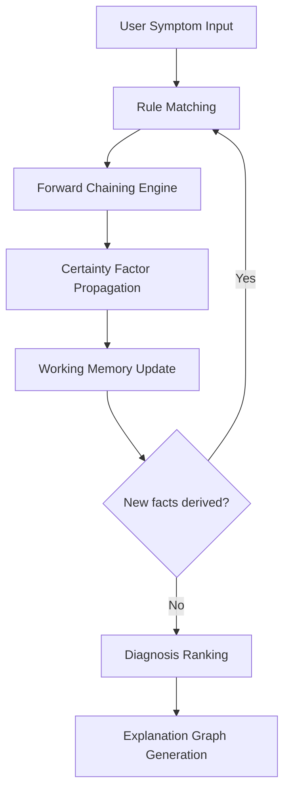
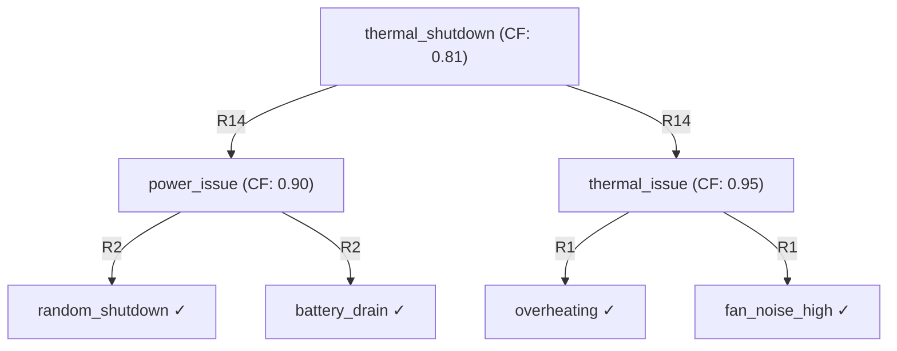

# Tech Diagnosis AI — Symbolic Expert System for Hardware & Software Fault Diagnosis

A deterministic, rule-based Knowledge-Based System (KBS) that diagnoses computer hardware and software faults through multi-layer forward-chaining inference with MYCIN-style Certainty Factor propagation.

This is **not** a machine learning system. There are no trained models, no statistical pattern matching, and no gradient-based optimization. Every conclusion is derived from explicit symbolic reasoning over a structured knowledge base.

## Quick Technical Snapshot

| Feature | Implementation |
|---|---|
| AI Paradigm | Symbolic AI — Rule-Based Expert System |
| Reasoning Engine | Iterative Forward Chaining |
| Uncertainty Handling | MYCIN Certainty Factor Propagation |
| Explainability | Backward-Traversing Explanation Graphs |
| Knowledge Representation | Three-Layer IF-THEN Rule Hierarchy |
| Interface | PySide6 Dark-Themed GUI |
| Distribution | Standalone Windows Executable |


---

## Why Symbolic AI?

Diagnostic troubleshooting has properties that make it a natural fit for rule-based reasoning and a poor fit for machine learning:

| Property | Symbolic AI (This System) | Machine Learning |
|---|---|---|
| Knowledge source | Hand-crafted IF-THEN rules | Learned from training data |
| Reasoning | Deterministic symbolic inference | Statistical pattern matching |
| Explainability | Full rule trace — every conclusion is auditable | Typically opaque |
| Same input → same output | Always | Not guaranteed |
| Modifiable by experts | Edit `rules.json` directly | Requires retraining |
| Training data required | No | Yes |

**Why this matters:** A diagnostic system must explain *why* it reached a conclusion. A neural network can predict "likely thermal issue" but cannot show you the exact rule chain from "overheating + fan noise" to "clean cooling fans." This system can.

---

## Problem Overview

Computer hardware and software troubleshooting follows structured causal chains: symptoms → issues → root causes → remedies. This system models that chain explicitly, encoding domain knowledge as inference rules rather than learning statistical correlations from data.

---

## System Features

- **Multi-layer forward-chaining inference** — symptoms → issues → causes → recommendations across three discrete reasoning layers
- **MYCIN Certainty Factor propagation** — confidence propagates through inference chains; multiple evidence paths combine via `CF1 + CF2 − CF1×CF2`
- **Backward-traversal explanation graphs** — recursive dependency walker traces every conclusion back to its supporting evidence
- **Priority-weighted rule evaluation** — rules carry explicit priority scores governing resolution order
- **Loop protection via firing signatures** — `(rule_id, matched_facts)` fingerprinting prevents redundant re-evaluation
- **Asynchronous inference execution** — `QThread` worker keeps the UI responsive
- **Self-contained Windows executable** — PyInstaller-packaged; zero Python dependency

---

## Reasoning Architecture

### Inference Pipeline



### Rule Structure

Each rule is a JSON-encoded production:

```json
{
  "id": "R1",
  "layer": "issue",
  "conditions": [
    { "fact": "overheating", "value": true },
    { "fact": "fan_noise_high", "value": true }
  ],
  "conclusion": { "fact": "thermal_issue", "value": true, "name": "Thermal Issue Detected" },
  "confidence": 0.95,
  "priority": 10
}
```

| Field | Purpose |
|---|---|
| `layer` | Reasoning stage: `issue` → `cause` → `recommendation` |
| `conditions` | Conjunction of fact-value pairs — all must match in working memory |
| `confidence` | Rule's inherent certainty — base for CF propagation |
| `priority` | Tie-breaking score when multiple rules compete for the same conclusion |

### Forward Chaining Logic

The engine iterates exhaustively over the rule set:

1. Evaluate every rule's conditions against current working memory
2. If all conditions match → rule **fires**, conclusion enters working memory
3. CF propagation: `CF_conclusion = rule_CF × min(CF_premises)`
4. If conclusion already exists: CF combination: `CF_combined = CF1 + CF2 − CF1×CF2`
5. Repeat until no new facts are derived (fixed point) or iteration cap (100) is reached

This is a **data-driven, exhaustive** strategy — the engine derives everything possible from available evidence before terminating.

### Certainty Factor Strategy

Based on the MYCIN expert system model:

**Propagation** — confidence through a reasoning chain:

```
CF_conclusion = rule_CF × min(CF_premises)
```

The conclusion is bounded by the weakest premise.

**Combination** — when multiple rules support the same conclusion:

```
CF_combined = CF1 + CF2 − (CF1 × CF2)
```

Evidence accumulates toward certainty but never exceeds 1.0.

---

## Knowledge Representation

### Three-Layer Rule Hierarchy


Rules are organized into three semantic layers, each building on the conclusions of the previous one:

**Layer 1 — Issue Detection (R1–R10)** — maps raw symptom combinations to intermediate diagnostic conclusions

```
R1:  overheating ∧ fan_noise_high       → thermal_issue         (CF: 0.95)
R2:  random_shutdown ∧ battery_drain    → power_issue           (CF: 0.90)
R4:  slow_performance ∧ high_disk_usage → io_bottleneck         (CF: 0.90)
R8:  clicking_noise                     → mechanical_failure    (CF: 0.99)
R9:  no_display ∧ beeping_startup       → post_failure          (CF: 0.95)
```

**Layer 2 — Cause Attribution (R11–R20)** — maps issues (possibly combined with contextual facts) to root causes

```
R11: thermal_issue ∧ device_old         → dust_accumulation          (CF: 0.90)
R12: thermal_issue                      → thermal_paste_degradation  (CF: 0.60)
R14: power_issue ∧ thermal_issue        → thermal_shutdown           (CF: 0.90)
R18: mechanical_failure                 → hdd_failing                (CF: 0.99)
```

**Layer 3 — Recommendation Generation (R21–R32)** — maps root causes to actionable repair recommendations

```
R21: dust_accumulation      → clean_fan              (CF: 0.95)
R26: failing_storage        → backup_data            (CF: 0.99)
R28: hdd_failing            → backup_and_replace_hdd (CF: 0.99)
R31: post_failure           → check_ram_seating      (CF: 0.95)
```

### Fact Vocabulary

16 observable symptoms form the input layer — only these are user-supplied. All other facts are derived by the engine:

```
overheating       → "Device feels unusually hot"
fan_noise_high    → "Fans are loud or constantly spinning"
slow_performance  → "System is running much slower than usual"
clicking_noise    → "Clicking or grinding noise coming from the PC"
no_display        → "Computer turns on but screen remains black"
beeping_startup   → "Computer beeps several times during startup"
... (16 total)
```

---

## Inference Engine

Implementation: [`engine/inference_engine.py`](engine/inference_engine.py)

**Execution flow:**

```
1. Load user symptoms into working memory (initial facts, CF = 1.0)
2. Begin iteration loop (max 100 iterations, loop protection active)
3. For each rule in rules.json:
   a. Check all conditions against working memory
   b. If all conditions match → rule fires
   c. Compute CF_new = rule_CF × min(premise_CFs)
   d. If conclusion is new → add to working memory
   e. If conclusion exists → CF_combined = CF1 + CF2 − (CF1 × CF2)
   f. Record edge: (rule_id, from_facts, to_fact, cf_contribution)
4. If no new facts derived → terminate
5. Return (working_memory, trace_graph)
```

**Loop protection:** Each firing is fingerprinted as `(rule_id, frozenset(matched_fact_ids))`. Identical evidence sets cannot trigger the same rule twice.

---

## Explainability

The explanation system is a core architectural component, not an add-on. It provides full reasoning transparency — every derived conclusion can be traced back to its supporting evidence through a structured dependency graph.

### Backward Traversal Algorithm

After inference, [`engine/explanation.py`](engine/explanation.py) recursively walks the `trace_graph` backward from any target conclusion to the original user inputs:



✓ = initial user input (leaf node of the reasoning graph)

### Text Trace Output

```
* Inferred: Critical Thermal Shutdown (CF: 0.81)
  Because Rule R14 fired:
    * Inferred: Power Delivery Issue (CF: 0.90)
      Because Rule R2 fired:
        - random_shutdown (Initial User Input)
        - battery_drain (Initial User Input)
    * Inferred: Thermal Issue Detected (CF: 0.95)
      Because Rule R1 fired:
        - overheating (Initial User Input)
        - fan_noise_high (Initial User Input)
```

Every inference step is inspectable. No conclusion is a black box.

---

## Example Diagnosis Flow

**User reports:** overheating, fan noise, random shutdowns, battery drain, device age > 4 years

**Iteration 1 — Issue detection:**

```
R1:  overheating ∧ fan_noise_high → thermal_issue   (CF = 0.95 × 1.0 = 0.95)
R2:  random_shutdown ∧ battery_drain → power_issue  (CF = 0.90 × 1.0 = 0.90)
```

**Iteration 2 — Cause attribution:**

```
R11: thermal_issue ∧ device_old → dust_accumulation          (CF = 0.90 × 0.95 = 0.855)
R12: thermal_issue → thermal_paste_degradation               (CF = 0.60 × 0.95 = 0.57)
R13: power_issue ∧ device_old → battery_degradation          (CF = 0.95 × 0.90 = 0.855)
R14: power_issue ∧ thermal_issue → thermal_shutdown          (CF = 0.90 × 0.90 = 0.81)
```

**Iteration 3 — Recommendations:**

```
R21: dust_accumulation → clean_fan              (CF ≈ 0.812)
R22: thermal_paste_degradation → repaste        (CF ≈ 0.513)
R23: battery_degradation → replace_battery      (CF ≈ 0.847)
R24: thermal_shutdown → improve_ventilation     (CF ≈ 0.770)
```

**Iteration 4 — Fixed point reached. Engine terminates.**

| Recommendation | CF | Priority |
|---|---|---|
| Improve device ventilation immediately | 0.770 | 20 |
| Clean cooling fans and vents | 0.812 | 10 |
| Replace Battery | 0.847 | 15 |
| Repaste CPU/GPU | 0.513 | 5 |

---

## Technologies Used

| Component | Technology |
|---|---|
| Language | Python 3.10+ |
| Inference engine | Custom forward-chaining implementation |
| Confidence model | MYCIN Certainty Factor arithmetic |
| Knowledge base | JSON (rules + facts, engine-agnostic) |
| GUI framework | PySide6 (Qt6 bindings) |
| Async execution | `QThread` worker pattern |
| Explainability | Recursive backward graph traversal |
| Packaging | PyInstaller (single-file `.exe`) |
| Installer | Inno Setup (`.iss` script) |
| Testing | Python `unittest` (`test_engine.py`) |

---

## Project Structure

```
KBS Project/
├── engine/
│   ├── inference_engine.py    # Forward-chaining core with CF propagation and loop protection
│   ├── confidence.py          # MYCIN Certainty Factor: combine() and propagate()
│   └── explanation.py         # Recursive backward-traversal explanation graph builder
├── knowledge_base/
│   ├── facts.json             # Observable symptom vocabulary (16 symptoms)
│   └── rules.json             # Three-layer diagnostic rule set (32 rules: R1–R32)
├── ui/
│   ├── app.py                 # PySide6 async UI, QThread worker, dark theme
│   └── interface.py           # UI component layout and bindings
├── main.py                    # Application entry point
├── test_engine.py             # Unit tests for inference correctness
├── requirements.txt           # Python dependencies (PySide6)
├── Tech Diagnosis AI.spec     # PyInstaller build specification
├── Tech Diagnosis AI.exe      # Pre-built Windows executable
├── Tech_Diagnosis_AI_Setup.exe # Inno Setup installer
└── setup.iss                  # Inno Setup compiler script
```

---

## Screenshots

**Diagnosis Interface — Symptom selection and result display**


> Additional screenshots to add: reasoning trace output, rule evaluation panel, CF score display.

---

## Engineering Challenges

1. **Multi-path CF combination** — when multiple rules support the same conclusion via different evidence, the system must accumulate certainty (MYCIN probabilistic sum) rather than overwrite. Required tracking whether facts are new or already in memory before deciding combine vs. insert.

2. **Rule specificity vs. coverage** — single-condition rules (e.g., `clicking_noise → mechanical_failure`, CF: 0.99) are high-confidence because the symptom is specific; multi-condition rules are used when symptoms are ambiguous alone. This balance required deliberate authoring, not mechanical enumeration.

3. **Loop prevention in iterative inference** — inferred facts become premises for later rules, creating potential cycles. Firing signatures `(rule_id, frozenset(matched_facts))` prevent redundant execution while still allowing re-firing on genuinely new evidence.

4. **Recommendation ordering** — multiple valid recommendations derive simultaneously. Priority scores ensure high-urgency results (`backup_data`, priority 25) surface above lower-urgency ones (`update_usb_drivers`, priority 5).

5. **Knowledge base scalability** — the three-layer hierarchy keeps rules single-responsibility. New hardware categories can be added to each layer independently without modifying existing rules.

---

## Limitations

- **Static knowledge base** — no feedback loop from diagnostic outcomes; rules do not self-correct
- **Binary fact model** — symptoms are present/absent; no graduated or fuzzy values
- **Closed-world assumption** — unreported symptoms are treated as false, not unknown
- **No continuous data reasoning** — cannot process sensor readings, temperature values, or load percentages
- **Limited rule coverage** — 32 rules cover common faults; compound failures may fall outside scope
- **No learning capability** — the system cannot discover new diagnostic patterns from historical cases

---

## Future Improvements

- **Fuzzy fact representation** — support graded truth values for partial symptom evidence
- **Bayesian augmentation** — replace CF arithmetic with conditional independence modeling
- **Hybrid symbolic-ML pipeline** — ML classifier for free-text symptom extraction → symbolic engine for reasoning
- **Domain expert rule authoring UI** — visual editor for adding/modifying rules without JSON editing
- **Case-based reasoning layer** — historical case similarity matching as supplementary evidence
- **REST API deployment** — stateless HTTP endpoint for integration with diagnostic tools

---

## Installation & Usage

### Option A — Pre-built Executable (Windows)

No Python required:

```
Tech Diagnosis AI.exe
```

Or use the installer:

```
Tech_Diagnosis_AI_Setup.exe
```

### Option B — Run from Source

**Requirements:** Python 3.10+

```bash
git clone https://github.com/Mark1amgad/Tech-Diagnosis-AI.git
cd Tech-Diagnosis-AI
pip install -r requirements.txt
python main.py
```

### Option C — Rebuild Executable

```bash
pip install pyinstaller
pyinstaller "Tech Diagnosis AI.spec"
```

Output → `dist/` directory.

---

### Author
* **Mark Amgad Nassief Botros Mekhaiel**
  * *Artificial Intelligence Engineering Student*
  * *Faculty of Computer Science and Engineering*
  * *New Mansoura University*
